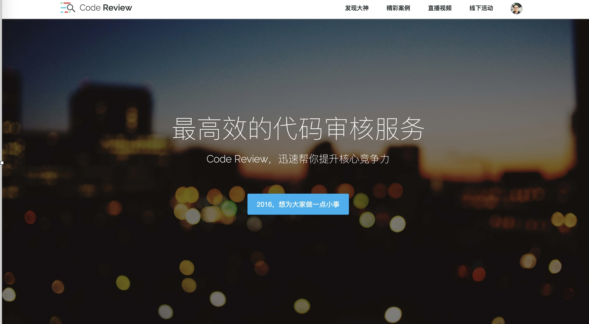
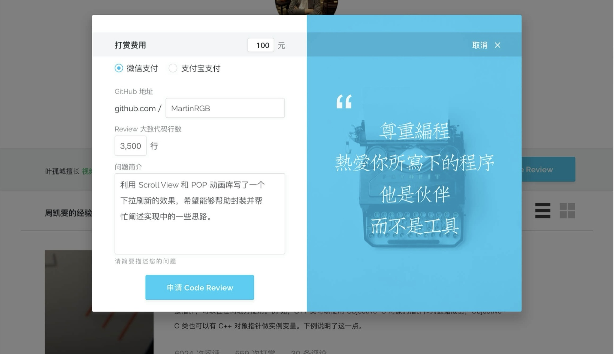

# code-review-server

# Projects

* [code-review-server](https://github.com/lzwjava/code-review-server)
* [code-review-web](https://github.com/lzwjava/code-review-web)

# Deploy

Deploy: fab -H root@reviewcode.cn deploy

Install dependencies: composer install, composer update

# API

- `GET /user/self`
- `DELETE /user/tags/:tagId`
- `POST /user/tags`
- `POST /orders`
- `GET /user/orders`
- `GET /orders/:orderId`
- `POST /orders/:orderId`
- `POST /orders/:orderId`
- `POST /orders/:orderId/reward`
- `GET /qiniu/token`
- `GET /reviewers`
- `GET /reviewers/:reviewerId`
- `POST /reviews`
- `PATCH /reviews/:reviewId`
- `GET /reviews`
- `GET /reviewers/:reviewerId/reviews`
- `POST /reviews/:reviewId/visits`
- `GET /videos`
- `POST /videos/:videoId/visits`
- `DELETE /orders/:orderId`
- `POST /user/requestResetPassword`
- `POST /user/resetPassword`

